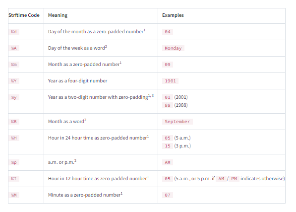
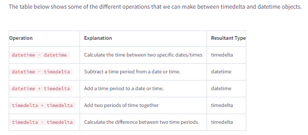

# 1. Introduction to Python Programming

## A. Python Programming
- _skipped_

## B. Basic Operators and Data Structures in Python

### B1. Python For Loops
- Basic for loop ex:

```python
app_names = ['Facebook', 'Instagram', 'Clash of Clans', 'Fruit Ninja Classic', 'Minecraft: Pocket Edition']

for app in app_names:
    print(app)
```

- Opening CSV file example:

```python
from csv import reader

with open("AppleStore.csv") as opened_file:
    read_file = reader(opened_file)
    apps_data = list(read_file)
    
rating_sum = 0
# Starting from 1 instead of 0, to skip header row
for row in apps_data[1:]:
    rating_sum += float(row[7])
    
avg_rating = rating_sum/(len(apps_data)-1)
```

### B4. Python Dictionaries
- Dictionary declaration & creation

```python
# first way
d = {'key_1': 1, 'key_2': 2}

# second way
d2 = {}
d2['key_1'] = 1
d2['key_2'] = 2
```

- Accessing/ retrieving items in Dictionary

```python
dictionary = {'key_1': 100, 'key_2': 200}
dictionary['key_1']  # Outputs 100
dictionary['key_2']  # Outputs 200
```

###  B5. Dictionaries and Frequency Tables

- Checking key value existence in Dictionary

```python
content_ratings = {'4+': 4433, '9+': 987, '12+': 1155, '17+': 622}

is_in_dictionary_1 = '9+' in content_ratings # True
is_in_dictionary_2 = 987 in content_ratings  # False
```

- Calculating frequency table with dictionary

```python
opened_file = open('AppleStore.csv')
from csv import reader
read_file = reader(opened_file)
apps_data = list(read_file)

genre_counting = {}

for app in apps_data[1:]:
    genre = app[11]
    if genre in genre_counting:
        genre_counting[genre] += 1
    else:
        genre_counting[genre] = 1
        
print(genre_counting)
# {'Social Networking': 167, 'Photo & Video': 349, 'Games': 3862, 'Music': 138, 'Reference': 64, 'Health & Fitness': 180, 'Weather': 72, 'Utilities': 248, 'Travel': 81, 'Shopping': 122, 'News': 75, 'Navigation': 46, 'Lifestyle': 144, 'Entertainment': 535, 'Food & Drink': 63, 'Sports': 114, 'Book': 112, 'Finance': 104, 'Education': 453, 'Productivity': 178, 'Business': 57, 'Catalogs': 10, 'Medical': 23}
```

- Calculating frequency table with dictionary, with intervals
  - When there are many values, it would be better to use intervals to map the frequencies to, in order to reduce the length of the table for easier analysis

```python
opened_file = open('AppleStore.csv')
from csv import reader
read_file = reader(opened_file)
apps_data = list(read_file)

rating_counts = []

for app in apps_data[1:]:
    rating_counts.append(app[5])
    
max_count = max(rating_counts)
min_count = min(rating_counts)

print(max_count)
print(min_count)

data_sizes = {
    '0-200':0,
    '200-400': 0,
    '400-600': 0,
    '600-800': 0,
    '800-1000': 0
}

for app in apps_data[1:]:
    rating = int(app[5])
    if rating >= 0 and rating < 200:
        data_sizes['0-200'] += 1
    elif rating >=200 and rating < 400:
        data_sizes['200-400'] += 1
    elif rating >=400 and rating < 600:
        data_sizes['400-600'] += 1
    elif rating >=600 and rating < 800:
        data_sizes['600-800'] += 1
    else:
        data_sizes['800-1000'] += 1
        
print(data_sizes) # {'0-200': 3256, '200-400': 586, '400-600': 329, '600-800': 222, '800-1000': 2804}
```

## C. Python Functions and Jupyter Notebook

### C4. Returning Multiple Variables and Function Scopes

- In Python, you can return multiple values from a function
  - Comma-separated values are tuples, so functions returning multiple values, return them as tuple

```python
def sum_and_difference(a, b):    
    a_sum = a + b    
    difference = a - b    
    return a_sum, difference

sum_1, diff_1 = sum_and_difference(15, 10)
```

## D. Intermediate Python for Data Science

### D1. Cleaning and Preparing Data in Python

- Cleaning data by removing characters

```python
test_data = ["1912", "1929", "1913-1923",
             "(1951)", "1994", "1934",
             "c. 1915", "1995", "c. 1912",
             "(1988)", "2002", "1957-1959",
             "c. 1955.", "c. 1970's", 
             "C. 1990-1999"]

bad_chars = ["(",")","c","C",".","s","'", " "]

def strip_characters(word):
    cleaned_word = word
    for c in bad_chars:
        cleaned_word = cleaned_word.replace(c, "")
    return cleaned_word


stripped_test_data = []

for data in test_data:
    stripped_test_data.append(strip_characters(data))
```

- Checking substring existence in a string:

```python
if "car" in "carpet":
    # ....
```

### D2. Python Data Analysis

- Using `.format()` for string templating

```python
artist = "Pablo Picasso"
birth_year = 1881

print("{name}'s birth year is {year}".format(name=artist,year=birth_year)) # Pablo Picasso's birth year is 1881
```

- Formatting numbers
  - Ex: `.2f` specifices precision of two (two numbers after the decimal )
  - Ex: `:,` inserts commas into number

```python
print("The population of {c} is {p:,.2f} million".format(c=pop[0],p=pop[1])) # The population of China is 1,379.30 million
```

### D3. Object-Oriented Python

- Empty class

```python
class MyClass:
    pass
```

- Instantiating instances of class

```python
mc_1 = MyClass()
```

- Defining class with instance attributes and methods

```python
class MyClass:
    def __init__(self, param_1):
        self.attribute_1 = param_1

    def add_20(self):
        self.attribute_1 += 20

mc_3 = MyClass(10) # mc_3.attribute_1 = 10
```

### D4. Working with Dates and Times in Python

- Three standard modules for working with dates and times:
  - `calendar`
  - `time`
  - `datetime`

- `datetime` "main" classes
  - `datetime.datetime`: working with date and time data
  - `datetime.time`: for working with time data only
  - `datetime.timedelta`: for representing time periods

- Example of importing `datetime` and its classes

```python
import datetime as dt

obj = dt.datetime()
```

- Converting String to datetime & formatting
  - strftime
    - Special syntax system used to describe date and time formats
    - 
  - `datetime.strptime(stringToParse, format)` returns date time object
    - use to convert string to datetime
  - `datetime_instance.strftime(format)` returns string representation of the datetime object, formatted according to the param

```python
# strptime
date_1_str = "24/12/1984"
date_1_dt = dt.datetime.strptime(date_1_str, "%d/%m/%Y")
print(date_1_dt) # 1984-12-24 00:00:00

# strftime
dt_object = dt.datetime(1984, 12, 24)
dt_string = dt_object.strftime("%d/%m/%Y")
print(dt_string) # 24/12/1984
```

- Convert string to time

```python
# use dt.strptime(), then convert into time object

time_str = "8:00"
time_dt = dt.datetime.strptime(time_str,"%H:%M")
time_t = time_dt.time()
print(time_t) # 08:00:00
```

- Adding/Subtracting times
  - 

```python
# Adding a time period to a datetime object

d1 = dt.date(1963, 2, 26)
d1_plus_1wk = d1 + dt.timedelta(weeks=1)
```

